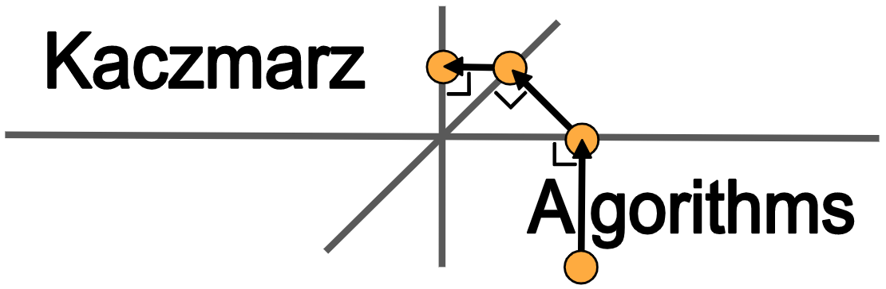

<div align="center">

</div>

<h2 align="center">Variants of the Kaczmarz algorithm for solving linear systems</h2>

<div align="center">
<a href="https://pypi.org/project/kaczmarz-algorithms/"></a>
<a href="https://pypi.org/project/kaczmarz-algorithms/"></a>
<a href="https://github.com/jdmoorman/kaczmarz-algorithms/actions"></a>
<a href="https://codecov.io/gh/jdmoorman/kaczmarz-algorithms"></a>
<a href="https://github.com/psf/black"></a>
</div>


<!-- <h3 align="center">
  <a href="#installation">
    Installation
  </a>
  <span> | </span>
  <a href="#usage">
    Usage
  </a>
  <span> | </span>
  <a href="https://kaczmarz-algorithms.readthedocs.io/en/stable/api.html">
    Documentation
  </a>
  <span> | </span>
  <a href="#citing">
    Citing
  </a>
  <span> | </span>
  <a href="#development">
    Development
  </a>
</h3> -->

---


## Installation
To install Kaczmarz Algorithms, run this command in your terminal:

```bash
$ pip install -U kaczmarz-algorithms
```

The `-U` argument is optional. It specifies that the most package should be upgraded to the most recent version if it is already installed.

If you don't have [pip](https://pip.pypa.io) installed, these [installation instructions](http://docs.python-guide.org/en/latest/starting/installation/) can guide you through the process.

## Usage

Import the package

```python
>>> import kaczmarz
```

Define your system of equations (e.g. `3 * x0 + x1 = 9` and `x0 + 2 * x1 = 8`)

<!--
```python
>>> import numpy as np
>>> np.set_printoptions(precision=3)
```
-->

```python
>>> A = [[3, 1],
...      [1, 2]]
>>> b = [9, 8]
```

Solve the system of equations using the Kaczmarz algorithm with a cyclic selection rule

```python
>>> x = kaczmarz.Cyclic.solve(A, b)
>>> x
array([2., 3.])
```

Similarly, to solve the same system of equations using the max-distance selection rule

```python
>>> x = kaczmarz.MaxDistance.solve(A, b)
```

For a complete list of selection strategies, check the [docs](https://kaczmarz-algorithms.readthedocs.io/en/stable/api.html). If your desired selection strategy is not provided, please open an issue with your suggestion!

#### Inspect the iterates

To access the iterates of the Kaczmarz algorithm use `kaczmarz.SelectionStrategy.iterates()`. For example,

```python
>>> A = [[1, 0, 0],
...      [0, 1, 0],
...      [0, 0, 1]]
>>> b = [1, 1, 1]
>>> x0 = [0, 0, 0]  # Initial iterate
>>> for xk in kaczmarz.Cyclic.iterates(A, b, x0):
...     xk
array([0., 0., 0.])
array([1., 0., 0.])
array([1., 1., 0.])
array([1., 1., 1.])
```

#### Inspect the rows/equations used

You can access the row index used at each iteration as `iterates.ik` in the following example.

```python
>>> iterates = kaczmarz.Cyclic.iterates(A, b, x0)
>>> for xk in iterates:
...     print("Row used:", iterates.ik)
Row used: -1
Row used: 0
Row used: 1
Row used: 2
```

The initial value of `iterates.ik` is `-1`, since no projections have been performed yet at the start of the algorithm.

#### Optional arguments

The `solve()` and `iterates()` functions take optional arguments of `maxiter` and `tol`
to specify a limit on the number of iterations
and the desired accuracy of the solution respectively.

#### Creating your own selection strategy

To implement a selection strategy of your own, inherit from `kaczmarz.Base` and implement the `_select_row_index()` method.
For example, to implement a strategy which uses of the equations of your system in reverse cyclic order:

```python
>>> class ReverseCyclic(kaczmarz.Base):
...     def __init__(self, A, *args, **kwargs):
...         super().__init__(A, *args, **kwargs)
...         self.n_rows = len(A)
...         self.row_index = None
...
...     def _select_row_index(self, xk):
...         if self.row_index is None:
...             self.row_index = self.n_rows
...         self.row_index = (self.row_index - 1) % self.n_rows
...         return self.row_index
```

Your new class will inherit `solve()` and `iterates()` class methods which work the same way as `kaczmarz.SelectionStrategy.solve()` and `kaczmarz.SelectionStrategy.iterates()` described above.

```python
>>> iterates = ReverseCyclic.iterates(A, b, x0)
>>> for xk in iterates:
...     print("Row used:", iterates.ik)
...     print("Iterate:", xk)
Row used: -1
Iterate: [0. 0. 0.]
Row used: 2
Iterate: [0. 0. 1.]
Row used: 1
Iterate: [0. 1. 1.]
Row used: 0
Iterate: [1. 1. 1.]
```

## Citing
If you use our code in an academic setting, please consider citing our code.
You can find the appropriate DOI for whichever version you are using on [zenodo.org](https://zenodo.org/badge/latestdoi/255942132).


## Development
See [CONTRIBUTING.md](CONTRIBUTING.md) for information related to developing the code.
